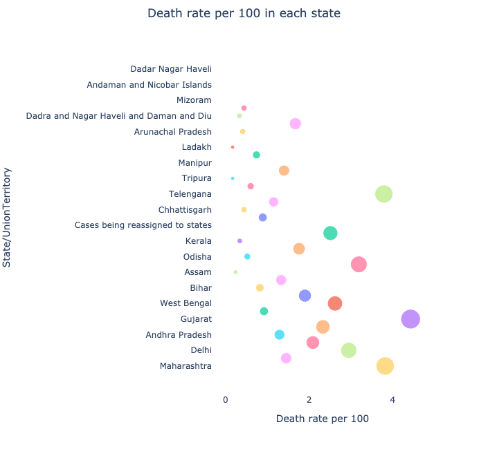

# Covid19-Future-Forecasting

---
kaggle link: https://www.kaggle.com/shubhamksingh/cracking-covid19-prediction-in-depth-eda

In this project, which was later adapted as part of a research paper, I followed these steps:

Data Collection and Preprocessing: I collected data from the following sources:

* “Ministry of Health and Family Welfare India” website (https://www.mohfw.gov.in/)
* “World Health Organization (WHO) website (https://covid19.who.int/table)
* “Our World In Data” website (https://ourworldindata.org/coronavirus)
* “Kaggle” website (https://www.kaggle.com/)
> I performed data cleaning and preprocessing as a lot of data was missing in all the datasets.

* Data Analysis: After cleaning the datasets, I started looking for insights in the data and serching for meaningful information and relations between different attributes. For this taks I used tools such as pandas and numpy.

* Data Visualization: In the next step, I started visualizing different fields of the datasets using multiple python visualization libraries such as Matplotlib, Seaborn and Plotly.

* Forecasting: In this final step, I used various machine learning methods to forecast and make future predictions of new cases, recovery, and total deaths. The methods used for this prediction include Prophet, Arima, Lasso, Linear Regression, Ridge Regression, Stacking & Blending of different ML models.
***

Below are the visualizations:

